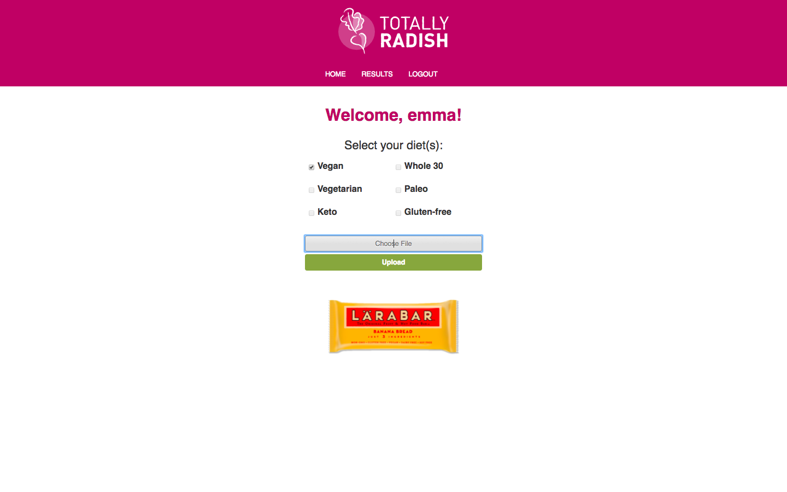
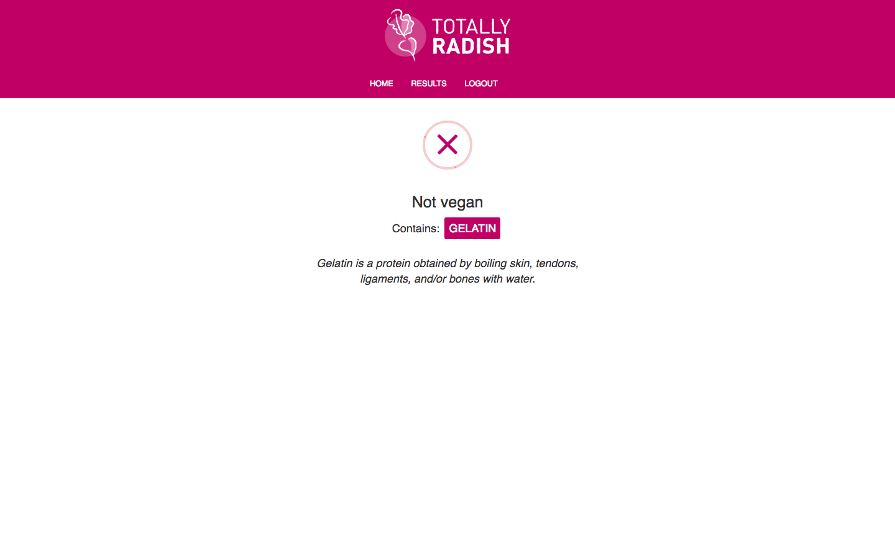

# Totally Radish

New to being a vegan? Dazed and confused starting at incomprehendible lists of ingredients for products? Totally radish allows you to quickly make sure a product you are eating/buying is 100% vegan-friendly! Just take a photo or upload an existing photo to the app and it'll do the hard work for you.

## Built With

- AngularJS
- Express
- Node.js
- PostgreSQL
- Bootstrap
- Passport
- NutritionIX API
- OCR API

## Getting Started

These instructions will get you a copy of the project up and running on your local machine for development and testing purposes. See deployment for notes on how to deploy the project on a live system.

### Prerequisites

Install the following on your computer to run this app.

- [Node.js](https://nodejs.org/en/)
- Postgresql

### Installing

Run the SQL queries found in [this google document] in Postico to get TotallyRadish up and running on your device. 

[this google document]: https://docs.google.com/document/d/1WyUPnFUakyPK7dAQM2rdyiW_e3oFgp6Ju5mJyYy7wWg/edit

## Screen Shot

### Completed Features

- [x] User can upload a photo from their device. Upon clicking 'upload', a message will pop up telling the user whether or not the product is vegan.
- [x] If the product is not vegan, a list of any non-vegan ingredients and their descriptions will be displayed.

### Next Steps

- [ ] Expand the app to include other diets, including gluten-free, Paleo, Whole 30, religious dietary restrictions, and others
- [ ] Make the app mobile-responsive

## Authors

* Developers: Liz Haakenson, Levy Kohout, Kim Mai, and Emma Stout
* UX Designer: Kelsey Gullickson
* Project Manager and Researcher: Maham Maus

